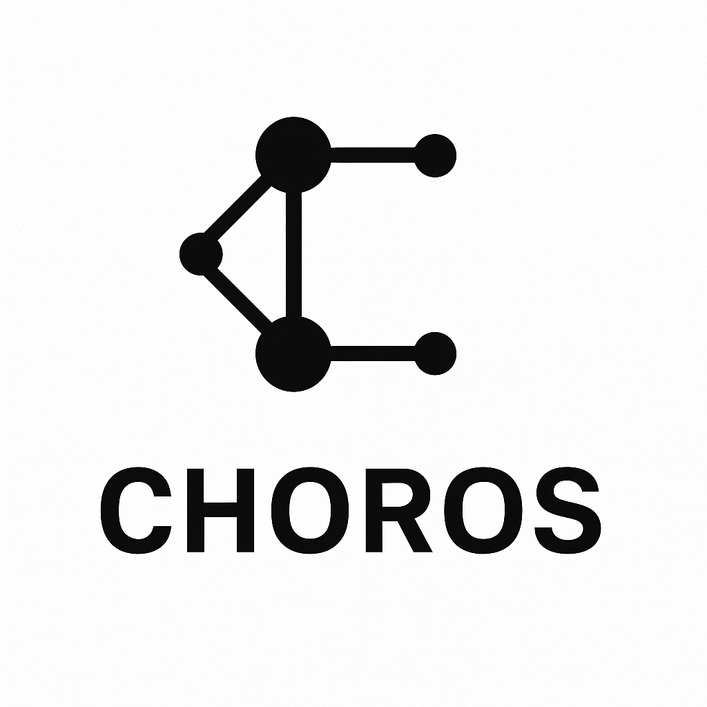

<table align="center">
  <tr>
    <td></td>
    <td><h1 style="margin: 0;">Choros: Declarative Multi-Robot Coordination for Botball</h1></td>
  </tr>
</table>

**Choros** is a lightweight, modular coordination framework for autonomous multi-robot systems, designed specifically for the Botball educational robotics competition.

This implementation is based on the paper [**Choros: A Distributed Coordination Framework for Multi-Robot Botball Systems**](./Choros.pdf), included in this directory. While the architecture follows the paper closely, some aspects have been adjusted to suit the practical constraints of the Botball competition.

---

## Overview

Choros introduces a **declarative** approach to robot control. Instead of writing low-level, sequential instructions, teams define:

* The goals to achieve
* Where each task takes place
* Task dependencies

The system:

* Resolves tasks as a **directed acyclic graph (DAG)**
* Computes paths using a graph-based navigation system
* Coordinates robots using UDP-based heartbeats

---

## Components

| File                 | Description                                       |
| -------------------- | ------------------------------------------------- |
| `task.hpp/cpp`       | Defines the task interface and `TaskResult` logic |
| `lifecycle.hpp/cpp`  | Manages task execution and robot lifecycle phases |
| `navigation.hpp/cpp` | Provides graph-based pathfinding with Dijkstra    |
| `heartbeat.hpp/cpp`  | Handles robot communication via UDP and JSON      |

All components are within the `choros` namespace.

---

## Features

* Maintains a declarative task graph
* Computes shortest paths between nodes, with support for blacklisting
* Supports pluggable tasks and robot-specific lifecycle behavior
* Can be used with [Pulse](https://github.com/WeThePeopleBotball/pulse) to enable multi-robot coordination.
